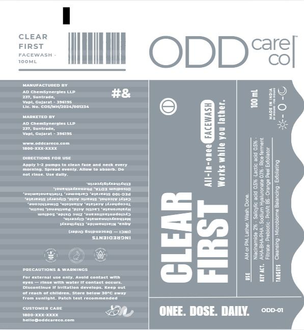
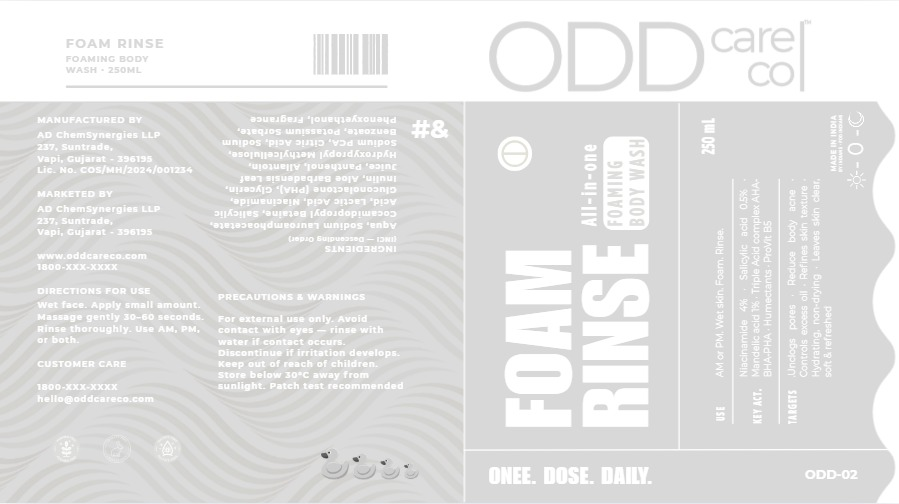
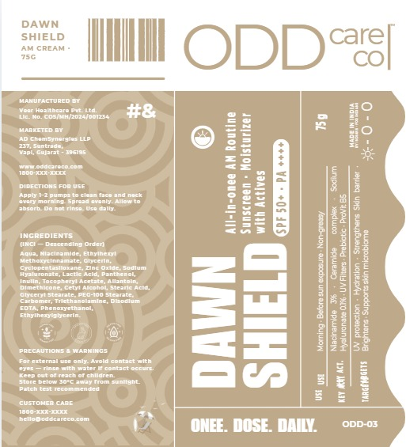
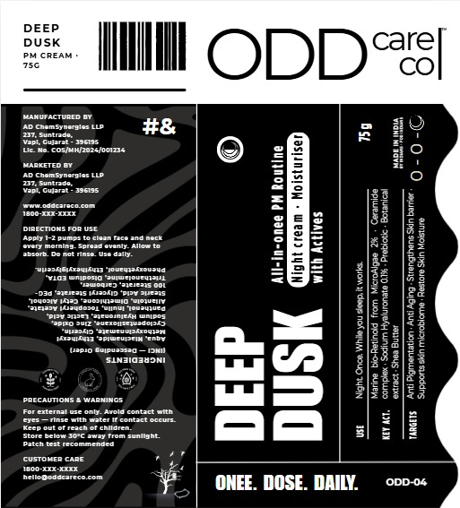
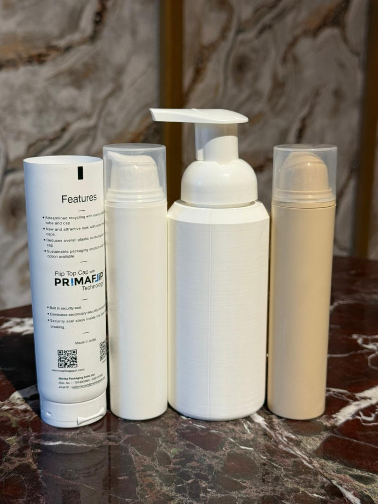

# E-Commerce Website — Project Brief

## Project Overview

- **Platform:** WooCommerce (WordPress)
- **Type:** E-commerce website for healthcare/personal care products (facewash, creams, etc.)
- **Current Product Count:** 4
- **Client:** Requires a brand-flexible website that can adapt beyond skincare in the future

## Client Requirements

- User account registration and login page
- Database to store user information (accounts, orders, etc.)
- Product catalog with 4 initial products
- Shopping cart and checkout functionality
- WooCommerce-powered backend for product and order management

## Brand Philosophy

- **Tagline:** "Skincare for people who have better things to do"
- **Core Idea:** Products for people who don't know skincare — simple, no-nonsense, and approachable
- **Honesty-First Approach:** The client wants to build a brand around honesty. All product messaging should be straightforward and transparent — no exaggeration, no hype

## Product Description Guidelines

- Describe exactly what the product does — nothing more, nothing less
- No exaggerated claims (e.g., avoid "cures dark spots" or "removes acne overnight")
- If it's a face cream, say what the face cream actually does in plain language
- Tone: direct, honest, minimal — like talking to a friend who asked "what does this do?"

## Design Direction

- **Theme:** Minimalist
- **Important:** The website should NOT look like a typical skincare brand. The client may pivot products in the future, so the design must be category-neutral — it should not "scream" skincare
- **Color Palette:**
  - Black
  - White
  - Light Beige
  - Sage Green
- **Overall Feel:** Clean, modern, understated — the design should let the products and honest copy do the talking

## Brand Details

- **Brand Name:** ODD Care Co
- **Brand Motto:** "ONEE. DOSE. DAILY."
- **Brand Tagline:** "Skincare for people who have better things to do"

## Product Catalog

### 1. Clear First (ODD-01)
- **Type:** Facewash
- **Size:** 100 ml
- **Packaging:** Tube
- **Use:** AM or PM. Lather. Wash. Done.
- **Key Actives:** Niacinamide 2%, Salicylic acid 0.5%, Lactic acid 0.5%, AHA+BHA+PHA, Sodium Hyaluronate 0.1%, Rice Ferment Filtrate, Prebiotic ProVit B5, Orange Peel Exfoliator
- **Targets:** Cleansing, Microbiome Balancing, Exfoliating
- **Label:** 

### 2. Foam Rinse (ODD-02)
- **Type:** Foaming Body Wash
- **Size:** 250 ml
- **Packaging:** Taller pump bottle (foaming)
- **Use:** AM or PM. Wet skin. Foam. Rinse.
- **Key Actives:** Niacinamide 4%, Salicylic acid 0.5%, AHA+BHA+PHA, Humectants, ProVit B5
- **Targets:** Unclog pores, Reduce body acne, Controls excess oil, Refines skin texture, Hydrating non-drying, Leaves skin clean soft & refreshed
- **Label:** 

### 3. Dawn Shield (ODD-03)
- **Type:** AM Cream (All-in-one AM Routine — Sunscreen + Moisturizer with Actives)
- **Size:** 75 g
- **Packaging:** Narrow pump bottle
- **SPF:** 50+, PA ++++
- **Use:** Morning. Before sun exposure. Non-greasy.
- **Key Actives:** Niacinamide, Ceramide complex, Sodium Hyaluronate, UV Filter, PROVIMC B5
- **Targets:** UV protection, Hydration, Strengthens Skin Barrier, Brightens, Supports skin microbiome
- **Label:** 

### 4. Deep Dusk (ODD-04)
- **Type:** PM Cream (All-in-one PM Routine — Night Cream + Moisturizer with Actives)
- **Size:** 75 g
- **Packaging:** Narrow pump bottle
- **Use:** Night. Once. Wake up. Sleep. Levels.
- **Key Actives:** Marine Bio-Retinol from Microalgae, Niacinamide 2%, Shea Butter
- **Targets:** Anti Pigmentation, Strengthens Skin Barrier, Supports skin microbiome, Retains Moisture
- **Label:** 

## Packaging Overview



Packaging types:
- **AM/PM Creams (Dawn Shield & Deep Dusk):** Narrow pump bottles
- **Facewash (Clear First):** Tube
- **Body Wash (Foam Rinse):** Taller pump bottle (foaming dispenser)

## Pricing

| Product | Individual Price |
|---------|-----------------|
| Clear First (Facewash) | ₹499 |
| Foam Rinse (Body Wash) | ₹449 |
| Dawn Shield (AM Cream) | ₹399 |
| Deep Dusk (PM Cream) | ₹549 |
| **The Whole Routine (Bundle)** | **₹1,499** (save ₹397) |

Individual total: ₹1,896 → Bundle: ₹1,499

## Product Description Pages — Status

All 5 product description pages have been created as static HTML files in `product-pages/`. These serve as content blueprints before WooCommerce integration.

### Format
- **Shorter tabbed format** — client-requested concise, to-the-point layout
- Each page is a self-contained HTML file with inline CSS and JavaScript
- Tabbed navigation for content sections (except the bundle page)
- Expandable ingredient cards with tap-to-reveal details
- Does/Doesn't grids, comparison rows, review cards, honest disclosure cards

### Pages

| File | Product | Theme | Tabs |
|------|---------|-------|------|
| `clear-first-facewash.html` | Clear First (Facewash) | Sage/Beige | wait / does / ingredients / reviews / honest |
| `foam-rinse-bodywash.html` | Foam Rinse (Body Wash) | Sage/Beige | wait / does / ingredients / reviews / honest |
| `dawn-shield-sunscreen.html` | Dawn Shield (AM Cream) | Warm Amber | excuses / does / ingredients / reviews / honest |
| `deep-dusk-nightcream.html` | Deep Dusk (PM Cream) | Dark/Black | retinol story / why you need this / does / ingredients / reviews / honest |
| `the-whole-routine-bundle.html` | The Whole Routine (Bundle) | Purple Accent | No tabs — member grid, timeline, does/doesn't, reviews |

### Product-Specific Design Notes
- **Facewash:** Sage green accents, comparison rows vs standard facewash, 7 expandable ingredients
- **Body Wash:** Sage green accents, body zone map, comparison rows, 5 expandable ingredients
- **Sunscreen:** Warm amber palette (#bfa98b, #f7f2eb), excuse accordion with verdicts, SPF visual explainer, India-specific UV dark strip
- **Night Cream:** Full dark theme with algae-green accents, bio-retinol story section, GenZ sleep science strip, weekly timeline, 3 expandable ingredients
- **Bundle:** Purple accent (#534AB7, #EEEDFE), 2×2 click-to-select member grid, timed daily routine timeline, no tabs

### Key Content Decisions
- All ingredients are the **actual product ingredients** from this brief (not from reference templates)
- Bundle named **"The Whole Routine"** (client-approved)
- All pages cross-reference the bundle: "or get all 4 in The Whole Routine — ₹1,499"
- Products cross-reference each other where relevant (e.g., night cream mentions sunscreen dependency)
- Brand voice maintained across all pages: direct, honest, Gen Z-aligned, no hype

## Next Steps

- [x] Homepage design
- [x] Static product pages (HTML blueprints)
- [x] Push homepage to WordPress
- [x] Push all 5 product pages to WordPress
- [x] Kadence theme + child theme installed and configured
- [x] Manifesto page — static blueprint + WordPress page template created
- [ ] Create "Why 4" WordPress page (Admin → Pages → Add New → Template: Manifesto → Slug: why-4)
- [ ] Our Mission page — static blueprint exists, needs WordPress page creation (slug: our-mission)
- [x] Add Manifesto + Our Mission buttons to homepage footer
- [x] Header icons (cart + account) added to Kadence header
- [x] My Account page — styled, branded, WooCommerce registration enabled
- [ ] WooCommerce product setup and integration
- [ ] Plugin installation (Razorpay payments, SEO, etc.)
- [ ] Shipping configuration
- [ ] Testing and launch

## WordPress Integration — Status

**Local environment:** Local by Flywheel — `http://odd-care-co.local/`
**Theme:** Kadence (active)
**Auth method:** WordPress REST API with `X-WP-Nonce` from `wpApiSettings.nonce`

### Live Pages

| Page | WordPress URL | Page ID |
|------|--------------|---------|
| Homepage | `http://odd-care-co.local/` | 26 |
| Clear First (Facewash) | `http://odd-care-co.local/clear-first/` | 31 |
| Foam Rinse (Body Wash) | `http://odd-care-co.local/foam-rinse/` | 33 |
| Dawn Shield (AM Cream) | `http://odd-care-co.local/dawn-shield/` | 35 |
| Deep Dusk (PM Cream) | `http://odd-care-co.local/deep-dusk/` | 37 |
| The Whole Routine (Bundle) | `http://odd-care-co.local/the-whole-routine/` | 39 |
| My Account | `http://odd-care-co.local/my-account/` | 9 |

All pages are published with Kadence full-width layout and no page title (meta: `_kad_post_title: hide`, `_kad_post_layout: fullwidth`, `_kad_post_vertical_padding: remove`).

Homepage is set as the static front page in WordPress Settings → Reading.

### How Pages Were Pushed

All pages are pushed as raw HTML via the WordPress REST API (`POST /wp-json/wp/v2/pages`). Key technical details:

- **Gutenberg block wrapper**: Content is wrapped in `<!-- wp:html -->...<!-- /wp:html -->` to bypass WordPress's `wpautop` filter (which would otherwise insert `<p>` tags inside `<style>` blocks and break CSS selectors).
- **CSS variables**: `:root` CSS variable declarations are stripped before pushing. All `var(--xxx)` references are replaced with hard-coded hex values because variables defined inside a page's `<style>` tag don't propagate globally in Chrome. The full replacement map is in `window._createProductPage` (see Technical Notes below).
- **Kadence padding**: A `<style>.entry-content-wrap{padding-top:0!important;padding-bottom:0!important}</style>` snippet is appended to every page to remove Kadence's default content padding.
- **Homepage product card links**: All point to `/clear-first/`, `/foam-rinse/`, `/dawn-shield/`, `/deep-dusk/`, `/the-whole-routine/` (not `/product/...` WooCommerce-style URLs).

### CSS Variable Replacement Map

Used when pushing any page to WordPress (to avoid `:root` propagation issues):

```
--odd-black     → #000
--odd-white     → #fff
--odd-sage      → #9CAF88
--odd-beige     → #F5F0EB
--odd-dark      → #1a1a1a
--odd-gray      → #555
--odd-border    → #e5e5e5
--text-primary  → #1a1a1a
--text-secondary→ #555
--text-tertiary → #888
--bg-secondary  → #fafaf9
--border-light  → #e5e5e5
--warm          → #bfa98b      (Dawn Shield)
--warm-light    → #f7f2eb
--warm-border   → #e0d4c0
--warm-text     → #6b5540
--warm-dark     → #4a3828
--night         → #0d0d0d      (Deep Dusk)
--night-card    → #1a1a1a
--night-border  → #2a2a2a
--night-text    → #666
--night-heading → #e0e0e0
--algae         → #2d5a3a
--algae-light   → #4a8a5a
--algae-bg      → #0d1a10
--algae-border  → #1a3320
--purple        → #534AB7      (Bundle)
--purple-light  → #EEEDFE
--purple-border → #AFA9EC
--purple-dark   → #3C3489
--purple-text   → #7F77DD
```

## Manifesto Page — Status

**Session date:** 2026-04-13

The "Why 4" manifesto page explains the brand's core philosophy — why only 4 products, what was eliminated and why, and who the products are for.

### Source
Client provided reference at `odd_care_why4_manifesto.html` — plain content without design formatting.

### Files Created

| File | Purpose |
|------|---------|
| `product-pages/manifesto.html` | Static HTML blueprint (standalone, for preview/reference) |
| `wp-content/themes/oddcareco-child/page-manifesto.php` | WordPress blank-canvas page template |

### WordPress Page Template: "Manifesto"
- **Template name:** Manifesto (selectable in Page Attributes sidebar)
- **Blank canvas** — bypasses Kadence header/footer entirely; uses its own nav
- Still calls `wp_head()` / `wp_footer()` so SEO plugins and analytics work
- Nav links are dynamic WordPress URLs (`wc_get_page_permalink('shop')`, `home_url()`)
- **To activate:** Admin → Pages → Add New → Title: `Why 4` → Template: `Manifesto` → Slug: `why-4` → Publish

### Design Features
- Sticky scroll-progress bar (sage green, 2px)
- Sticky chapter strip with 6 tabs (intro / the problem / what we cut / the hard part / who it's for / the deal) — updates active state on scroll, clickable to jump
- Fade-in animations on all sections (IntersectionObserver)
- **Strike list:** 6 eliminated products strikethrough sequentially (180ms apart) on scroll into view
- **Counter animation:** "17" counts up 0→17 when the formulation stat block enters view
- **"Who it's for" list:** 4 paragraphs slide in with 130ms stagger
- Full-bleed beige pull quote section breaks the column rhythm
- Admin bar compatible (no z-index or fixed positioning conflicts)

### Content Structure (5 parts)
1. **Intro** — "The skincare industry has a vested interest in your confusion."
2. **Part One** — Nobody actually needs 12 products (with industry stat callout)
3. **Part Two** — Products eliminated + interactive strikethrough list → kept list
4. **Part Three** — Multifunctional formulation is harder (17 iterations counter)
5. **Part Four** — Who it's for + product colour row
6. **Ending** — Why we'll never make a 5th product + dark callout
7. **CTA** — "Get the group project — ₹1,499" + "See all 4 products"

---

## Session Log — 2026-04-13

### What was done
1. **Manifesto page built** — static blueprint (`product-pages/manifesto.html`) and WordPress blank-canvas template (`page-manifesto.php` in child theme). Content sourced from client reference file `odd_care_why4_manifesto.html`. All scroll animations, chapter strip, counter, and stagger effects implemented.

2. **Homepage footer buttons attempted** — added `.footer-links` CSS and two ghost-style buttons ("Manifesto" → `/why-4`, "Our Mission" → `/our-mission`) to the live WordPress homepage (page ID 26) via a one-time PHP update script. Changes were **rolled back** after the page broke — to be reattempted in next session with a safer approach.

3. **Child theme confirmed** — `oddcareco-child` is active on `odd-care-co.local`. Kadence parent theme installed. Child theme has `functions.php` (nav dropdown enhancement + product carousel) and `style.css` (brand variable overrides).

### Pending from this session
- Create the "Why 4" WordPress page and assign the Manifesto template
- Investigate why the homepage footer buttons broke the page before re-adding them
- Our Mission page (`product-pages/our-mission.html` exists) needs its own WordPress page and template

---

## Reference Materials

_Client-provided rough design references were used to build the product description pages. The shorter tabbed format was the final client-approved direction._

---

## Session Log — 2026-04-13 (Homepage Polish & Bug Fixes)

All changes applied to live Local by Flywheel WordPress site. Files modified: `oddcareco-child/style.css`, `oddcareco-child/functions.php`, WordPress page ID 26 (homepage content via block editor API).

### Changes Made

1. **Header: removed brand name text** — "ODD Care Co." text next to logo hidden via `.site-title-wrap { display: none }` in child theme CSS. Logo-only.

2. **Ticker bar: fixed contrast** — Non-highlighted items (no serum, no toner, etc.) were `#3a3a3a` on `#111111` background — near invisible. Changed to `#888888`. Product items remain sage green.

3. **Hero copy update** — "We're not making more." → "For skincare. That's the full lineup." Scopes the claim to skincare only, leaves room for future product categories.

4. **Products dropdown nav** — Consolidated individual product header links into a "PRODUCTS" dropdown. Created WordPress nav menu programmatically via PHP. Dropdown contains: Clear First, Foam Rinse, Dawn Shield, Deep Dusk, The Whole Routine — Bundle.

5. **Premium dropdown design** — Dark luxury panel (`#0d0d0d`, sage top border). JS in `wp_footer` adds rich structure per item: product code (ODD-01 in sage), name (white), type + price (muted gray). Bundle item has sage left border + greenish tint. Slide-in animation, hover highlights.

6. **Product section → auto-scroll carousel** — 2-column grid converted to full-bleed infinite auto-scrolling carousel (same style as header ticker). Cards are 300px wide, loop seamlessly via JS-cloned duplicates, animate at 36s/loop. Hovering pauses scroll.

7. **Carousel/bundle spacing** — Added `margin-bottom: 3.5rem` to carousel wrap and `margin-top: 0.5rem` to `.bundle-row` to prevent them collapsing together.

8. **Footer: Manifesto + Our Mission links** — Custom `.odd-footer` injected via `kadence_before_footer` hook. Dark `#0d0d0d` panel, brand name + tagline left, nav links right (sage hover). Resolves the previously failed footer button attempt.

9. **Fixed `overflow: clip` on `.wp-site-blocks`** — WordPress block wrapper was clipping full-bleed elements. Overridden to `overflow: visible` in child theme CSS.

### Bugs Fixed

10. **Homepage broken — raw CSS rendered as text** — `<style>` and `</style>` tags were stripped from the page's Custom HTML block during a content edit. Detected via `mainContent` showing raw CSS. Fixed by re-wrapping the CSS block (boundary at first `<div>` ~char 12,783) via the WP block editor API.

11. **Hero "4" overlapping all text** — `.hero::before` (position: absolute, z-index: 0) was painting over static children after `.hero > * { position: relative; z-index: 1 }` was lost in the style strip. Re-added as permanent override in child theme CSS.

### Files Changed

| File | What changed |
|---|---|
| `oddcareco-child/style.css` | Ticker, dropdown, carousel, footer, hero z-index, overflow fix |
| `oddcareco-child/functions.php` | Dropdown JS enhancer, carousel builder JS, footer PHP hook |
| WordPress page ID 26 | Hero copy, product grid CSS, `<style>` tag restoration |

---

## Session Log — 2026-04-14 (Product Page Formatting & Bundle Redesign)

All changes applied to live Local by Flywheel WordPress site via temporary PHP updater script (`odd-update-page.php`, deleted after each push). Source HTML blueprints live in `product-pages/`.

### Changes Made

1. **Footer CTA transition fix (all pages)** — The white-to-beige footer CTA section had an abrupt edge. Added `border-radius: 32px 32px 0 0` and `box-shadow: 0 -2px 24px rgba(0,0,0,0.04)` to `.footer-cta` for a smooth rounded transition. Added `margin-top: 3rem` for spacing between content and footer CTA.

2. **Header formatting standardized (all pages)** — Applied Clear First's header pattern to Foam Rinse, Dawn Shield, Deep Dusk, and The Whole Routine:
   - `body { background: #fff }` — white header area
   - `header.site-header .custom-logo { max-height: 80px }` — compact logo
   - `#inner-wrap { background: #F5F0EB; border-radius: 32px 32px 0 0; box-shadow: ... }` — rounded beige content area
   - Breadcrumb moved inside `.hero-band`
   - `.honest-strip` changed from bordered box to top-border separator

3. **Deep Dusk green→black theme** — All algae-themed CSS (`.callout-algae`, `.ing-detail`, `.badge-hero`) remapped from green (`#2d5a3a`) to dark/night palette (`#1a1a1a`, `#2a2a2a`, `#333`) to match the page's night theme.

4. **The Whole Routine — blue→sage green** — Bundle page color theme changed from purple/blue to sage green. `--purple` variable values remapped: `#534AB7→#6B7F5A`, `#EEEDFE→#F0F4ED`, `#AFA9EC→#B8C8AD`, `#3C3489→#5A6B4A`, `#7F77DD→#7A9168`. Variable names kept as `--purple` to avoid renaming every CSS reference.

5. **The Whole Routine — hero section cleanup** — Removed the white `.box-hero` card (border, border-radius, background) so content fills the beige `.hero-band` directly without a nested card appearance.

### Pages Updated

| Page | ID | Theme |
|------|----|-------|
| Clear First | 31 | Beige (reference page) |
| Foam Rinse | 33 | Beige |
| Dawn Shield | 35 | Warm |
| Deep Dusk | 37 | Dark/Night |
| The Whole Routine | 39 | Sage Green (was purple/blue) |

### CSS Variable Map Update

The bundle page now uses sage green values for `--purple` variables:

```
--purple        → #6B7F5A  (was #534AB7)
--purple-light  → #F0F4ED  (was #EEEDFE)
--purple-border → #B8C8AD  (was #AFA9EC)
--purple-dark   → #5A6B4A  (was #3C3489)
--purple-text   → #7A9168  (was #7F77DD)
```

---

## Session Log — 2026-04-14 (Header Icons, My Account Page & Bug Fixes)

All changes applied to live Local by Flywheel WordPress site. Files modified: `oddcareco-child/style.css`, `oddcareco-child/functions.php`, WordPress page ID 26 (homepage), WordPress page ID 9 (My Account).

### Changes Made

1. **Header icons (cart + account)** — Removed "Cart" and "Checkout" text links from the primary navigation menu. Added SVG account (person) and cart (shopping bag) icons to the Kadence header via the HTML widget slot. Icons are placed in `main_right` alongside the nav. Implemented as a one-time `set_theme_mod()` setup in `functions.php` with `odd_header_icons_v2` flag to prevent re-execution.

2. **My Account page — full brand styling** — Styled the WooCommerce My Account page (page ID 9) to match the ODD Care Co brand:
   - Single-column layout (overriding Kadence's default sidebar layout)
   - Horizontal nav tabs on beige background with sage-green active pill
   - Custom dashboard greeting: "YOUR ACCOUNT" eyebrow + "Hey, {name}." + subtitle
   - Hidden default WooCommerce greeting paragraphs and Kadence avatar
   - Removed "Downloads" nav item (physical products only)
   - Styled forms, inputs, order tables, address cards, and info/notice boxes
   - Login/register form with split layout, sage-green submit buttons
   - Responsive breakpoint at 768px
   - Page meta: fullwidth layout, hidden title, removed vertical padding
   - Enabled WooCommerce registration on My Account page (`woocommerce_enable_myaccount_registration = yes`)

3. **Homepage script fix** — Raw `faqToggle` JavaScript function was rendering as visible text above the footer. The `<script>` tags had been stripped during a previous content update. Fixed by re-wrapping the bare JS in `<script>` tags via REST API update.

4. **Footer color transition fix** — White background was bleeding between the dark "The whole group" CTA section and the dark footer. Fixed with:
   - `.home .entry.content-bg { background: transparent !important }` — removed white article wrapper background
   - `.footer-cta { padding-bottom: 0; margin-bottom: 0 }` — eliminated spacing gap
   - `.odd-footer { margin-top: 0; border-top: none }` — seamless transition
   - `.site-footer`, `.site-bottom-footer-wrap` — forced `#0d0d0d` background on Kadence copyright footer

### Files Changed

| File | What changed |
|---|---|
| `oddcareco-child/functions.php` | Header icon setup (`set_theme_mod`), removed Downloads nav, custom dashboard greeting, hidden default WooCommerce greeting |
| `oddcareco-child/style.css` | Full My Account page styling (~200 lines), footer transition fixes, Kadence copyright footer dark theme |
| WordPress page ID 26 | Re-wrapped bare `faqToggle` JS in `<script>` tags |
| WordPress page ID 9 | Set fullwidth layout, hidden title, removed padding meta |
| `product-pages/homepage.html` | Added sticky header with account/cart SVG icons |

### Technical Notes

- **Kadence Header Builder**: The Customizer JS API (`wp.customize().set()`) was unreliable for persisting header layout changes. PHP `set_theme_mod()` in `functions.php` with a one-time flag is the reliable approach.
- **Kadence Cart widget**: Collapses to 0×0px when WooCommerce has no products (`header-cart-is-empty-true` class). Both account and cart icons are placed in the HTML widget instead.
- **WordPress script stripping**: `<script>` tags inside `<!-- wp:html -->` blocks can be stripped during content updates. Always verify scripts are intact after REST API pushes.

---

## Session Log — 2026-04-15 (Footer Transition & Dark Page Contrast Fixes)

All changes applied to live Local by Flywheel WordPress site. File modified: `oddcareco-child/style.css`.

### Changes Made

1. **Homepage footer transition fix** — The transition between the footer CTA section, the ODD footer, and the Kadence copyright footer was rough with visible seams and color mismatches.
   - Unified `.footer-cta` background from `#1a1a1a` to `#0d0d0d` to match the footer sections
   - Added `padding-bottom: 4rem` to `.footer-cta` (was `0`) for breathing room before the brand footer
   - Removed side padding on `.home .entry-content-wrap` to fix beige bleed on edges
   - Replaced hard border dividers with subtle `rgba(255,255,255,0.05)` separators

2. **Homepage footer CTA text contrast** — Text in the dark footer CTA section was nearly invisible. Brightened all text colors:
   - `.footer-eyebrow`: `#444` → `#888`
   - `.footer-sub`: `#555` → `#aaa`
   - `.footer-fine`: `#333` → `#666`
   - `.btn-ghost-dark`: `#888/#333` → `#bbb/#555`

3. **ODD footer + Kadence footer text contrast** — Footer nav and copyright text were too dark:
   - `.odd-footer-tagline`: `#444` → `#888`
   - `.odd-footer-nav a`: `#555` → `#999`
   - `.site-footer .footer-html`: `#333` → `#666`
   - `.site-footer .footer-html a`: `#444` → `#777`

4. **Deep Dusk page (page ID 37) — full contrast overhaul** — The entire dark-themed page (`#0d0d0d` background) had text that was nearly unreadable. Added ~40 scoped `.page-id-37` overrides in child theme CSS:
   - Hero: labels, breadcrumb, stars, rating, price note, active tags all brightened
   - Tabs: inactive `#444` → `#777`, hover → `#aaa`, active → `#ddd`
   - Card/body text: `#666` → `#999`, callout spans `#888` → `#bbb`
   - GenZ strip: labels `#444` → `#777`, text `#888` → `#aaa`
   - Does/Doesn't grid: items and dots brightened for readability
   - Timeline: circle text, week labels, descriptions all brightened
   - Ingredients: intro, tldr, detail text, concentration all brightened
   - Reviews: tags, text, badges all brightened
   - Footer CTA: label and subtitle text brightened
   - Catch-all attribute selectors for inline `style="color: #333/444/555"` elements

5. **Tab scrollbar hidden (all product pages)** — The `.tabs` horizontal scrollbar was visible on product pages. Hidden via `scrollbar-width: none` (Firefox), `-ms-overflow-style: none` (IE/Edge), and `::-webkit-scrollbar { display: none }` (Chrome/Safari). Scroll functionality preserved.

### Files Changed

| File | What changed |
|---|---|
| `oddcareco-child/style.css` | Footer transition fix, footer CTA/footer text contrast, Deep Dusk full contrast overhaul (~40 rules), tab scrollbar hidden |

### Technical Notes

- **Inline style overrides**: Deep Dusk page content was pushed via REST API with hardcoded inline color values. Child theme CSS uses `.page-id-37` scoping with `!important` to override. Attribute selectors (`[style*="color: #333"]`) catch remaining inline styles.
- **Tab scrollbar**: The `.tabs` element uses `overflow-x: auto` for mobile scrolling. Scrollbar is hidden purely cosmetically — scroll still works via touch/trackpad.
